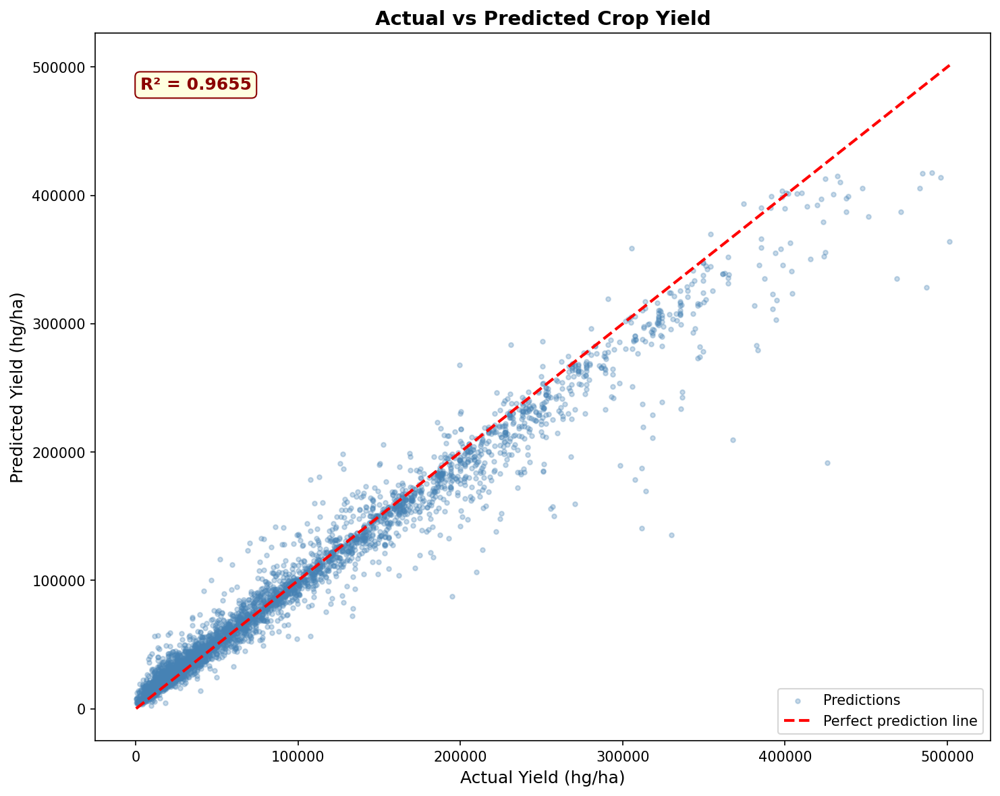
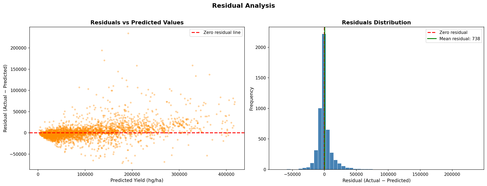
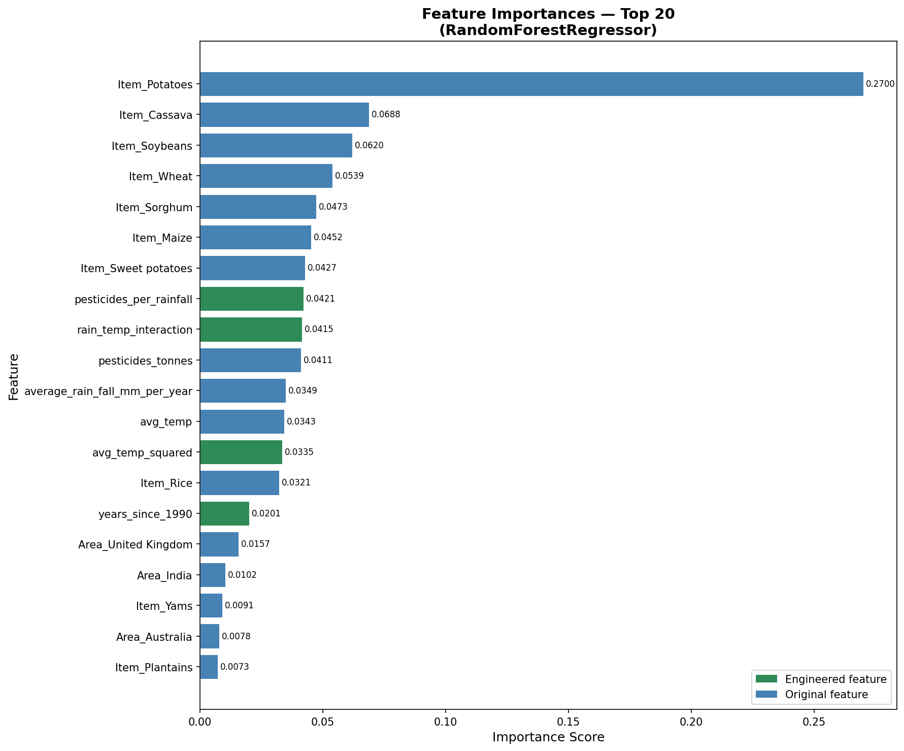

# Crop Yield Prediction
### CipherSense AI — Machine Learning Engineer Intern Technical Assessment

A reproducible machine learning pipeline that predicts crop yield (hg/ha) from environmental and agricultural features using the Crop Yield dataset from Kaggle.


Note:
[Link to Model file on google drive](https://drive.google.com/file/d/13mkfw04rB2gucKwupAAh73hiPRaU28Hq/view?usp=drive_link)
---

## Table of Contents

1. [Problem Description](#problem-description)
2. [Dataset Description](#dataset-description)
3. [Project Structure](#project-structure)
4. [Approach](#approach)
5. [How to Run the Project](#how-to-run-the-project)
6. [Results](#results)
7. [Known Limitations](#known-limitations)

---

## Problem Description

Crop yield prediction is a critical challenge in agricultural planning — enabling governments, farmers and organisations to anticipate food production, allocate resources efficiently and respond to climate variability. This project builds a supervised machine learning pipeline that predicts crop yield in hectograms per hectare (hg/ha) of 10 must consumed crops in the world from a combination of environmental conditions (rainfall, temperature), agricultural inputs (pesticides) and contextual factors (country, crop type, year).

The goal is not merely to achieve high accuracy but to demonstrate a clean, reproducible and well-documented ML engineering workflow — from raw data through cleaning, feature engineering, preprocessing and model evaluation.

---

## Dataset Description

**Source:** [Crop Yield Prediction Dataset — Kaggle](https://www.kaggle.com/datasets/patelris/crop-yield-prediction-dataset)

**Raw shape:** 28,242 rows × 8 columns (including a redundant index column)

| Column | Type | Description |
|--------|------|-------------|
| `Area` | Categorical | Country where the crop was grown (101 unique countries) |
| `Item` | Categorical | Crop type (10 unique crops after cleaning) |
| `Year` | Numerical | Year of observation (1990–2013)|
| `hg/ha_yield` | Numerical | **Target variable** — crop yield in hectograms per hectare |
| `average_rain_fall_mm_per_year` | Numerical | Average annual rainfall in mm |
| `pesticides_tonnes` | Numerical | Pesticide usage in tonnes |
| `avg_temp` | Numerical | Average temperature in degrees Celsius |

**Key dataset characteristics identified during EDA:**
- The target variable `hg/ha_yield` is heavily right skewed — mean (76,978 hg/ha) is nearly double the median (39,530 hg/ha), the largest mean-median gap in the dataset
- `pesticides_tonnes` is the most skewed feature — mean (34,782) is more than double the median (15,373)
- `average_rain_fall_mm_per_year` shows a multimodal distribution reflecting two distinct climate groups — arid and tropical regions
- The dataset contains a complete temporal gap for the year 2003 — present in the source data, not introduced during cleaning
- Both categorical features show significant representation imbalance — a small number of countries and crop types dominate the dataset

---

## Project Structure

```
ml-crop-yield-project/
├── data/
│   ├── raw/                        ← original Kaggle dataset
│   └── processed/
│       └── cleaned_yield.csv       ← cleaned and feature-engineered dataset
├── notebooks/
│   └── exploration.ipynb           ← full EDA, cleaning and feature engineering narrative
├── src/
│   ├── data_cleaning.py            ← reusable cleaning pipeline
│   ├── preprocessing.py            ← sklearn ColumnTransformer and train/test split
│   ├── train_model.py              ← model training, comparison and hyperparameter tuning
│   └── evaluate_model.py           ← final evaluation metrics and visualisations
├── models/
│   └── trained_model.pkl           ← saved best model pipeline (see note below)
├── requirements.txt
└── README.md
```

> **Note on trained_model.pkl:** The trained model file exceeds GitHub's file size limit for standard uploads and could not be included directly in the repository. it can be found at this [google drive link](https://drive.google.com/file/d/13mkfw04rB2gucKwupAAh73hiPRaU28Hq/view?usp=drive_link) Also the full training pipeline in `src/train_model.py` reproduces the model exactly — `random_state=42` is set throughout to ensure reproducibility. Run `python src/train_model.py` to regenerate the model.

---

## Approach

### 1. Data Cleaning

The cleaning pipeline is implemented in `src/data_cleaning.py` as a reusable `clean_data()` function. The following steps are applied in order:

**Step 1 — Drop redundant index column**
The raw CSV contains an `Unnamed: 0` column — a leftover artifact from how the file was originally saved. It carries no information and is dropped conditionally (safe whether or not the column is present).

**Step 2 — Remove duplicate rows**
2,310 duplicate rows were identified and removed, keeping the first occurrence. No information is lost since the rows are identical.

**Step 3 — Verify missing values**
No missing values were found across any column. This step is included explicitly to document that missing value handling was considered and verified rather than overlooked.

**Step 4 — Fix inconsistent categorical labels**
Two label inconsistencies were identified and corrected:
- `'Rice, paddy'` → `'Rice'`: The FAO technical label describes the post-harvest form of the crop rather than a different crop. Renamed for consistency with all other crop type labels in the dataset.
- `'Plantains and others'` → `'Plantains'`: The `'and others'` suffix introduces ambiguity. The category contains sufficient records to contribute meaningful signal, so rows were retained with a cleaner label.
- `'Potatoes'` and `'Sweet potatoes'` were deliberately kept separate — they represent genuinely different crops with different botanical classifications and yield characteristics.

**Step 5 — Outlier treatment**
Outliers were formally detected using the IQR method and investigated through grouped visualisations. The investigation confirmed that extreme values in `pesticides_tonnes` are concentrated in a small number of industrialised farming nations, and extreme values in `hg/ha_yield` are driven by specific high-productivity crop types. Both represent genuine agricultural patterns rather than data errors.

**Decision: all outliers retained** for three reasons:
1. Confirmed as real values — not data entry errors
2. Random Forest and Gradient Boosting are tree-based models naturally robust to outliers
3. Removing them would discard genuine agricultural signal the model should learn from

**Step 6 — Fix data types**
All columns were verified and corrected to their expected types — categorical columns as `object`, numerical columns as `float64`, and `Year` as `int64`.

---

### 2. Feature Engineering

Four new features were created from existing columns based on domain knowledge of agricultural patterns and findings from EDA. Feature engineering is applied inside `data_cleaning.py` as the final step before saving the processed dataset.

| Feature | Formula | Rationale |
|---------|---------|-----------|
| `years_since_1990` | `Year - 1990` | Converts raw calendar year into a measure of agricultural progress since the start of the dataset. More meaningful to the model than a raw year number. The raw `Year` column is dropped after this feature is created. |
| `rain_temp_interaction` | `rainfall × temperature` | Captures the combined climate effect on yield. Heat and moisture together drive plant growth — neither variable alone expresses the full picture. |
| `pesticides_per_rainfall` | `pesticides ÷ (rainfall + 1e-6)` | Represents effective pesticide concentration. Heavy rainfall washes pesticides off crops before they take full effect — this ratio captures that real-world relationship. A small epsilon prevents division by zero. |
| `avg_temp_squared` | `temperature²` | Captures the non-linear temperature-yield relationship. Crop growth peaks at an optimal temperature and drops on both sides — a pattern a linear feature cannot express. |

> **Note on encoding:** OneHotEncoder is intentionally excluded from feature engineering. It is applied inside the sklearn Pipeline during preprocessing to prevent data leakage — ensuring the encoder learns category mappings from training data only and never sees test data during fitting.

---

### 3. Preprocessing Pipeline

The preprocessing pipeline is implemented in `src/preprocessing.py`. It applies different transformations to different column types simultaneously using a `ColumnTransformer`:

- **Numerical features** → `StandardScaler`: Brings all numerical features onto a comparable scale. Although tree-based models are not strictly scale-sensitive, scaling ensures the pipeline works correctly when a linear baseline model is also passed through it.
- **Categorical features** → `OneHotEncoder` (`handle_unknown='ignore'`): Creates one binary column per category. `handle_unknown='ignore'` ensures unseen categories in test or future data are silently encoded as all zeros rather than raising errors.

The preprocessor is returned unfitted from `build_preprocessor()` and assembled into a full `Pipeline` object in `train_model.py` — keeping preprocessing and model selection as separate responsibilities.

---

### 4. Modelling Decisions

Three models were trained and compared:

| Model | Role | Rationale |
|-------|------|-----------|
| Linear Regression | Baseline | Establishes a performance floor. Expected to underperform given the non-normal feature distributions and right-skewed target. |
| Random Forest | Primary | Tree-based ensemble naturally robust to outliers and non-linear relationships. No distributional assumptions. |
| Gradient Boosting | Primary | Sequential ensemble that builds on errors of previous trees. Strong performance on tabular data with mixed feature types. |

**Why tree-based models were chosen over linear models:**
- None of the features follow a normal distribution — Year is uniform, rainfall is multimodal, pesticides is strongly right-skewed, temperature is left-skewed
- The target variable `hg/ha_yield` is heavily right-skewed — a linear model would systematically underestimate high yield values
- Tree-based models make no distributional assumptions and handle non-linear boundaries naturally

**Hyperparameter tuning** was performed on the best model using `RandomizedSearchCV` with `n_iter=20` and `cv=5` (100 total fits). `RandomizedSearchCV` was chosen over `GridSearchCV` because the search space for tree-based models is large — random sampling finds good hyperparameters at a fraction of the computational cost.

`refit=True` (the sklearn default) means after finding the best hyperparameters, sklearn automatically retrains the model on the full training set before returning `search.best_estimator_` — no manual retraining step required.

The tuned model from `RandomizedSearchCV` was selected as the final model. Although the default model achieved a marginally higher test R² in this run, the tuned model's hyperparameters were validated across 5 cross-validation folds rather than a single train/test split — providing a more statistically reliable estimate of generalisation performance.

---

## How to Run the Project

### Prerequisites

```bash
pip install -r requirements.txt
```

### Step 1 — Run data cleaning

```bash
python src/data_cleaning.py \
    --input data/raw/yield_df.csv \
    --output data/processed/cleaned_yield.csv
```

This produces `data/processed/cleaned_yield.csv` — the cleaned and feature-engineered dataset ready for training.

### Step 2 — Train the model

```bash
python src/train_model.py \
    --input data/processed/cleaned_yield.csv \
    --output models/trained_model.pkl
```

This trains three models, compares their performance, tunes the best model using `RandomizedSearchCV` and saves the final pipeline to `models/trained_model.pkl`.

### Step 3 — Evaluate the model

```bash
python src/evaluate_model.py \
    --model models/trained_model.pkl \
    --input data/processed/cleaned_yield.csv \
    --output outputs/
```

This loads the saved model and produces the official evaluation metrics along with three plots saved to the `outputs/` folder.

### Running with default paths

All scripts use sensible defaults so you can also run them without arguments:

```bash
python src/data_cleaning.py
python src/train_model.py
python src/evaluate_model.py
```

### Note for Google Colab users

Add the `src/` directory to your Python path before running:

```python
import sys
sys.path.append('src')
```

---

## Results

All metrics reported on the held-out test set (20% of data, 5,187 rows). The train/test split uses `random_state=42` for full reproducibility.

### Model Comparison

| Model | RMSE | MAE | R² |
|-------|------|-----|-----|
| Linear Regression | 42,673.17 | 29,918.68 | 0.7488 |
| Random Forest (default) | 10,999.69 | 4,182.81 | 0.9833 |
| Gradient Boosting (default) | 31,452.16 | 20,165.78 | 0.8635 |


### Final Model Performance

| Metric | Value |
|--------|-------|
| RMSE | 15,807.38 |
| MAE | 8,313.85 |
| R² | 0.9655 |

### Interpretation

The final model explains **96.55%** of the variance in crop yield across 101 countries and 10 crop types spanning 23 years — a strong result for a dataset with this level of natural diversity.

The MAE of 8,313 hg/ha represents approximately **10.8% of the overall mean yield** (76,978 hg/ha), which is acceptable given that the model is predicting yield simultaneously across vastly different climates, farming practices and crop types.

The gap between RMSE (15,807) and MAE (8,313) indicates the presence of high-error predictions concentrated in the upper yield range — consistent with the heavily right-skewed target distribution identified during EDA. The model predicts low-to-moderate yields most reliably and struggles more with extreme high yield values that are underrepresented in training data. This is an inherent characteristic of the dataset rather than a modelling error.

---

### Evaluation Plots

**Actual vs Predicted**



The scatter plot shows the vast majority of predictions sitting tightly along the perfect prediction diagonal line — confirming the model's strong overall performance (R² = 0.9655). Predictions are most reliable in the low to moderate yield range where dots cluster closest to the line. In the upper yield range above 300,000 hg/ha the scatter widens and some dots fall noticeably below the diagonal — indicating the model tends to underestimate extreme high yields. This is consistent with the right skewed target distribution identified during EDA where the model has seen far fewer training examples of extreme yields.

---

**Residual Analysis**



The left plot shows a clear funnel shape — residuals are tightly clustered around zero for low predicted yields but spread increasingly wider as predicted yield increases. This unequal spread confirms that prediction errors are larger and less consistent in the upper yield range. The model is most confident and accurate for low to moderate yields and least reliable for extreme high values.

The right plot shows the residuals distribution is sharply concentrated around zero with a mean residual of 738 hg/ha — negligible relative to the overall yield scale of up to 500,000 hg/ha. This confirms the model has no meaningful systematic bias in either direction. The right skewed tail reflects the occasional large underprediction errors in the high yield range visible in the left plot.

---

**Feature Importance**



`Item_Potatoes` is by far the single most important feature with an importance score of 0.2700 — more than three times the next ranked feature. This confirms the EDA finding that crop type is the dominant predictor of yield, with potatoes being a particularly distinct high-productivity crop. Crop type features collectively dominate the top of the chart with Cassava, Soybeans, Wheat, Sorghum and Maize all appearing in the top 10.

All four engineered features appear in the top 20 — validating the feature engineering work:
- `pesticides_per_rainfall` (0.0421) and `rain_temp_interaction` (0.0415) both outperform the raw `pesticides_tonnes` (0.0411) and `average_rain_fall_mm_per_year` (0.0349) features they were derived from — direct evidence that the engineered features added predictive signal beyond what the original features alone provided
- `avg_temp_squared` (0.0335) captures the non-linear temperature relationship
- `years_since_1990` (0.0201) captures the temporal agricultural progress trend

Country features appear lower in the ranking — with only United Kingdom, India and Australia making the top 20 — suggesting that once crop type is accounted for, country adds relatively less additional signal. This is consistent with the observation that yield per hectare is driven more by what is being grown than where it is being grown.

## Known Limitations

**1. Categorical representation imbalance**
A small number of countries and crop types dominate the dataset. Model predictions are most reliable for well-represented countries and crops, and less reliable for underrepresented ones.

**2. Temporal gap — Year 2003**
The year 2003 is completely absent from the source data. No records exist for any country or crop type for that year. No imputation was performed — generating synthetic rows for an entire year would constitute data fabrication. The dataset covers 23 of 24 years (4.2% temporal gap) with minimal expected impact on model performance.

**3. Prediction reliability by yield range**
Because the target variable is heavily right-skewed, the model has been trained on far more examples of low-to-moderate yields than extreme high yields. Predictions are therefore more reliable and confident in the lower yield range.

**4. Notebook scope**
The exploration notebook (`notebooks/exploration.ipynb`) covers the complete analytical narrative — EDA, data quality investigation, cleaning decisions and feature engineering — in a single document to preserve the logical flow from observation to decision to action. All cleaning and feature engineering logic is additionally implemented as standalone executable scripts in `src/` for reproducibility.

---

## Dependencies

```
pandas
numpy
matplotlib
seaborn
scikit-learn
joblib
scipy
```

Install with:

```bash
pip install -r requirements.txt
```
